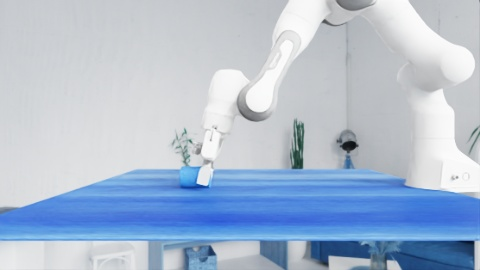
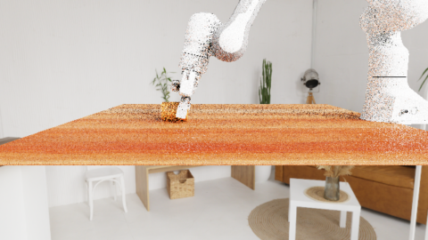
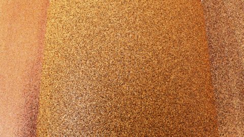

# Isaac Sim 6 Validation Comparison

**Purpose:** give a review meeting a precise answer to “what matches the official data, what differs, and what does that mean?” This document compares validated Isaac Sim 6 evidence with the selected official UniVTAC HDF episodes. It does not claim bit-identical replay where the evidence does not support it.

## Bottom line

The migrated simulator is functionally validated for the tested contact-rich tasks: `lift_can`, independent `pull_out_key`, and `insert_tube` seeds 42/43 pass their original task checks while retaining correct tactile no-contact, contact, release, planner, attachment, and camera behavior. Both official and local head/wrist policy images are `480x270x3`, and the corrected wrist camera is close to the gripper rather than the former distant room view. The `lift_can` trajectory is behaviorally aligned with the official reference but not identical at every frame. `lift_bottle` is the remaining discrepancy: its planner succeeds and its tactile/attachment data are healthy, yet the free bottle takes a different branch and correctly fails the unchanged final condition.

This is a successful compatibility migration with a bounded reproducibility gap, not evidence that the task's physics or success rules should be adjusted.

## Inputs, terminology, and limits

| Term | Meaning in this report |
| --- | --- |
| Official reference | The downloaded public HDF file and its extracted first/contact/last frames. It is a behavioral reference, not a guarantee that its filename seed maps to the current runtime's reset stream. |
| Local acceptance | A one-environment, headless, VRAM-guarded execution of the pinned Isaac Sim 6 image. |
| Same | The compared property agrees in role or tolerance: for example, flat no-contact/release or a passed unchanged task check. |
| Different | An observed trajectory, branch, count, or state that does not match exactly. It is reported, not hidden by changing a criterion. |

Selected official data retained locally during validation:

| Episode | File | SHA-256 |
| --- | --- | --- |
| Lift can | `validation_artifacts/reference_dataset/byml-UniVTAC/lift_can-clean-41/source/lift_can-clean-41.hdf5` | `dacd7f220170dd40e3574fc1693ad732f1761db3f43cb9d9eef347167ca0cea4` |
| Lift bottle | `validation_artifacts/reference_dataset/byml-UniVTAC/lift_bottle-clean-41/source/lift_bottle-clean-41.hdf5` | `7b0357c0df225e603f80c360acf37e1ad19decd841993d0bb416ea536a2878ae` |

Those local HDF files and all captured diagnostic output are intentionally excluded from the portable image. The code used to capture and analyze them remains in the migrated source.

## Cross-cutting comparison

| Property | Official/reference expectation | Local Isaac Sim 6 result | Assessment |
| --- | --- | --- | --- |
| Tactile no-contact and release | Flat height map at the sensor far plane | Both pads are exactly flat at 34 mm at no-contact/release in the final can acceptance. | Same semantic behavior. |
| Tactile contact | A spatially varying, shallower height map during grasp | Can reaches 27.63–34.0 mm left / 27.35–34.0 mm right; key reaches 26.96–27.50 mm left / 26.90–27.28 mm right. | Same contact signature, not an empty or saturated map. |
| Sensor frame | Markers/depth must move with the physical gelpad | 83 anchors/pad; camera position error at most 55.9 nm; rigid-fit RMS at most 0.771 micrometres. | Same frame semantics, validated numerically. |
| Attachment callback | Constrained gel follows attachment target without stale state | Callback-generation lag is zero in final can and key runs; can attachment maxima 0.356/0.381 mm. | Same operational behavior. |
| Planner/controller | Valid collision-aware waypoint plans and normal motion | All five can and all four key planner moves returned success; controller path—not state teleportation—was used. | Same control-path intent. |
| Resource outcome | Not a dataset property | Acceptance containers exit `0`, `OOMKilled=false`, around 6.9–7.0 GiB with a 10,000 MiB stop guard. | Safe for the tested one-environment hardware envelope. |

## Camera and tactile visual evidence (2026-09-07)

These are representative contact frames, not claims of pixel identity. The official and local RGB arrays shown below have the same policy shape (`480x270x3`). Their materials, RTX noise, lighting, and exact trajectory differ.

| Stream | Official dataset | Corrected local Isaac Sim 6 | Assessment |
| --- | --- | --- | --- |
| Head RGB |  |  | Same scene role and tensor shape; different table material and rendering distribution. |
| Wrist RGB |  |  | Same close-range wrist-camera role and tensor shape. The former approximately 0.671 m invalid hand offset is fixed; the retained distance is about 0.07596 m. |
| Left tactile RGB |  |  | Both show meaningful contact. Texture and deformation are behaviorally comparable, not frame-identical. |

Distributional measurements reinforce the distinction. Official versus local Laplacian variance is `117.16` versus `836.12` for head RGB and `43.04` versus `5273.76` for wrist RGB. Consecutive-frame MAE is `0.96` versus `4.07` for head and `1.60` versus `22.37` for wrist. The local stream is substantially grainier and more dynamic, but no longer has a shape or extrinsic defect.

The four-stream recorder also works: real simulator MP4s decode as `960x540` montages of head, wrist, left tactile, and right tactile views. The meeting copy is intentionally kept outside Git because it is 23.1 MB; its local path and checksum are recorded in the runtime guide and delivery notes.

## Additional task envelope (2026-09-07)

| Task / seed | Unchanged result | Evidence-based interpretation |
| --- | --- | --- |
| `collect` / 3992 tactile sanity | Camera validation and deliberate contact/release sanity pass; peak 7,433 MiB. | Observation pipeline acceptance, not task-policy success. |
| `lift_can` / 41 | Pass; 791 steps / 277 saved frames in the final camera run; peak 7,438 MiB. | Primary full-path acceptance and meeting demonstration. |
| `pull_out_key` / 41 | Pass; 788 steps / 205 saved frames in the final camera run; peak 7,490 MiB. | Independent contact-rich acceptance. |
| `insert_tube` / 41 | Plans and camera checks pass; unchanged task check fails because x is 5.288 mm against a strict `<5.000 mm` bound. | Marginal 0.288 mm seed-dependent execution edge, not a camera failure. |
| `insert_tube` / 42 and 43 | Both pass after 927/875 steps; peak 7,524/7,505 MiB. | Confirms task capability without changing physics or success tolerance. |
| `lift_bottle` / 44 | Normal generated command path fails the final task check; published command replay remains within 3.945 mm bottle error through rotate four. | Bounded controller/command-boundary reproducibility gap; not a broad physics failure. |

Physics remains configured at 120 Hz (`dt=1/120 s`). Measured end-to-end task throughput on this workstation is about 5.25--7.11 task steps/s because rendering, tactile sensing, planning, saving, and diagnostics add wall-clock cost. A video playback rate must not be presented as physics or policy frequency.

## `lift_can`: successful, behaviorally aligned reproduction

| Measure | Official selected reference | Local guarded acceptance | Interpretation |
| --- | --- | --- | --- |
| Capture extent | 163 saved reference frames in the matched controller replay | 281 saved frames, 799 task steps | Different sample/command cadence; the local run ran the full original task logic. |
| Rotation plan execution | 62 commands in each reference rotate sequence | 68 / 75 / 77 / 76 executed commands across four rotations | Different trajectory discretization/tracking length, not planner rejection. |
| Grasp | Contact-rich execution | Bilateral contact in 222 / 281 saved frames | Same meaningful two-pad contact behavior. |
| Depth | Contact contrast relative to flat far plane | 27.63–34.0 mm left; 27.35–34.0 mm right; release returns to 34 mm | Same observation semantics. |
| Final task result | Official successful episode | Unchanged local success check passes | Same task outcome. |
| Object final state | Published final state | 7.6 mm final translation difference; orientation is close | Behaviorally aligned but not bit-identical. |

The primary local evidence is `lift-can-sm120-seed41-pose-order-fix-guarded-20260903`. The can descends from 31.32 mm to 6.74 mm during rotation and to 1.488 mm after release; the reference final height is also 1.488 mm. That agreement, plus passed success and bilateral tactile contact, is stronger evidence than superficial image similarity alone.

## `lift_bottle`: healthy infrastructure, open free-object divergence

| Measure | Official reference | Local seed 41 | Local seed 44 | Assessment |
| --- | --- | --- | --- | --- |
| Planner | Executes the task sequence | Four rotate plans succeed | Four rotate plans succeed | Not a cuRobo query failure. |
| Tactile/attachments | Contact-rich bottle manipulation | Bilateral contact in 229 / 304 frames; depths 27.73–34.0 / 27.45–34.0 mm; attachment maxima 0.412 / 0.355 mm | Initial position/yaw closely matches reference; later free-object motion diverges | Not a tactile or attachment failure. |
| Reference completion branch | After rotate 4, target-local x is -45.78 mm, so two corrective moves run before release | After rotate 4, target-local x is +9.81 mm, so the unchanged mid-check passes and it opens directly | Same differing post-rotation behavior | The local free bottle follows a different source-consistent branch. |
| Final condition | Frames 279–289 meet it; final target-relative translation `(1.145, -46.500, 0.529)` mm and bottle local x-axis is vertical (`|dot z|≈1`) | `Plan True, Check False`; final translation approximately `(-14.35, +11.03, +25.36)` mm and orientation fails | `Plan True, Check False` | Correct failure under the original predicate; do not relax it. |

The HDF name `lift_bottle-clean-41` does not produce the same initial state under the current `np.random.default_rng(41)` reset stream: local seed 41 starts near `(+8.97, +24.36)` mm while the public first saved state is approximately `(-7.23, -26.61)` mm in the relevant plane. Seed 44 matches the public initial position/yaw closely, but the free bottle still diverges after the second rotation. The evidence therefore rules out reset pose alone and points to remaining free-object/policy dynamics reproducibility. No RNG, material, friction, UIPC, actuator, planner, or success-criterion workaround was applied.

### Command-path boundary (2026-09-07)

Two guarded, diagnostic-only seed-44 probes refine this conclusion without changing the pinned runtime. First, `replay_reference_controller.py` applies the published HDF joint positions and finite-difference velocities through the normal Isaac Lab controller path through reference step 412 (the fourth rotate). It starts within 0.005 mm of the published bottle state, keeps maximum joint error to 0.00536 rad, and keeps bottle position error below 3.945 mm (1.075 mm at the final step). The retained run exited `0` with a 7,324 MiB guard peak. Therefore the controller, UIPC/free-object path, and task mechanics are capable of following the public branch when driven by the public commands.

Second, the normal planner's first rotate was compared to the HDF's reconstructed two-tick held command stream, without executing that plan. The retained all-actor collision world produces 69 commands against the reference's 68 holds, with cadence-normalized joint-L2 RMS 0.00416, maximum 0.00674, and endpoint 0.00479. Ground-only and empty-world variants give the same 69-command family; supported solver-option variants do not improve the endpoint. In normal matched-reset execution, the command difference compounds across rotations to joint-L2 0.0535 by the fourth rotate and the bottle takes the alternative `check_mid_success` branch. This is a contact-sensitive command-path reproducibility gap, not evidence for a physics, RNG, collision-removal, or task-criterion change.

The safe next action is to obtain or reconstruct the exact legacy CuRobo command-generation configuration and verify it as an isolated planner diagnostic. It must not be substituted with public HDF playback in the normal task, because that would hide rather than resolve the migration discrepancy.

## Independent task: `pull_out_key`

`pull_out_key` was used as an independent acceptance task rather than as an official-HDF frame-for-frame comparison. The guarded seed-41 run passes the unchanged key lift, slot stability, orientation, and grasp checks after 794 steps / 208 saved frames. Its four planner queries pass, both pads are in central contact in all 208 saved frames, attachment maxima are 0.761 / 0.763 mm, and callback-generation lag is zero.

This matters because it exercises a different object, contact regime, and task predicate. It supports the claim that the migration is not a can-specific visual fix.

## Excluded result: `grasp_classify`

`grasp_classify` is not a negative simulator comparison. In the workspace used for the reported run, scene construction stopped before simulation because `assets/objects/RoughPrism.usd` and `assets/objects/PlainPrism.usd` were absent. Its container exited cleanly after a Python `FileNotFoundError`, which must not be reported as a passed task. The standalone simulator repository now contains those assets, but that checkout has not yet received a guarded acceptance run; replacement assets were not invented in the tested workspace.

## How the evidence was made trustworthy

1. A static visual check was never treated as sufficient. Capture records planner results, touch depth, attachment error, camera pose, and moving-frame fit.
2. Resource safety was checked separately: container exit status, `OOMKilled`, and a 10,000 MiB VRAM guard were recorded for every acceptance run.
3. No success condition or mechanics value was changed to force agreement with the official data.
4. Results distinguish a task-policy/dynamics difference from an observation, planner, callback, or memory failure.

## Meeting-ready conclusion

- **What is now working:** a portable Isaac Sim 6 Docker runtime, corrected pose, camera, tactile-observation, and video paths, collision-aware planning, normal controller execution, and successful `lift_can`, independent `pull_out_key`, and `insert_tube` seeds 42/43.
- **What matches the official behavior:** tactile far-plane/contact/release semantics, bilateral grasp behavior, a successful lift-can outcome, final can release height, and the intended task/control flow.
- **What differs:** exact command/frame counts and a 7.6 mm final can translation; these are reported as trajectory differences, not hidden.
- **What remains to investigate:** `lift_bottle` command/controller-boundary reproducibility, rendering-distribution parity for policies sensitive to appearance, and a guarded `grasp_classify` acceptance using the standalone repository's assets.
- **What should not be done:** change Isaac versions, physics parameters, random-number semantics, actuator limits, planner margins, or success criteria merely to chase a reference trajectory.
